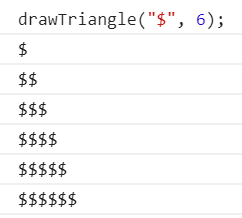

# drawTriagle
Напишите функцию, которая рисует треугольник
Функция принимает 2 аргумента.
Первый аргумент это произвольный символ из которого будет состоять треугольник,
второй аргумент - высота треугольника.
Высота треугольника не может быть меньше 3 строк (то есть вызов функции со вторым аргументом равным 1-це, всё равно нарисует треугольник высотой 3, любой другой аргумент больше 3-х нарисует треугольник согласно величине аргумента).

 

</li>
<li>
Напишите функцию, которая принимает строку и возвращает строку с заглавными буквами.

 
